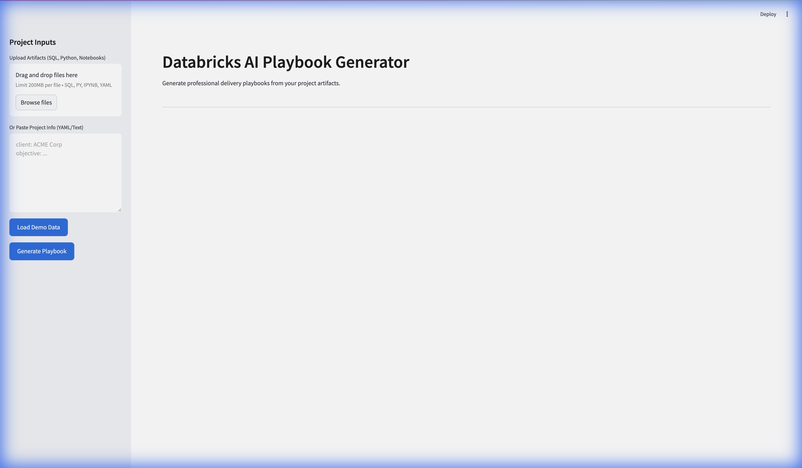
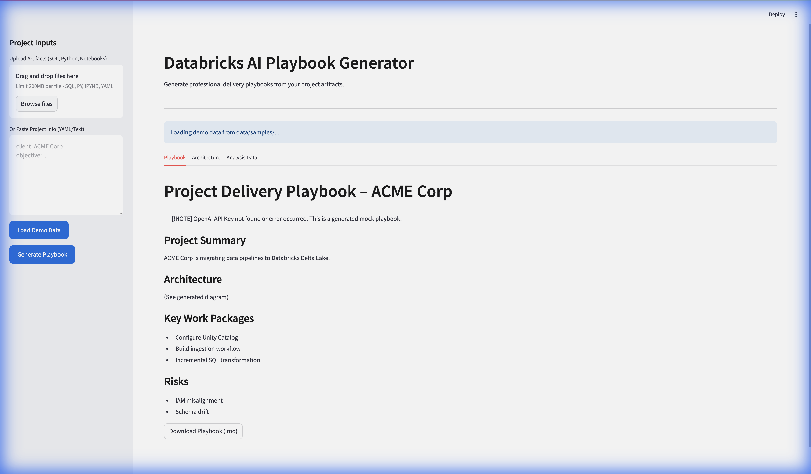
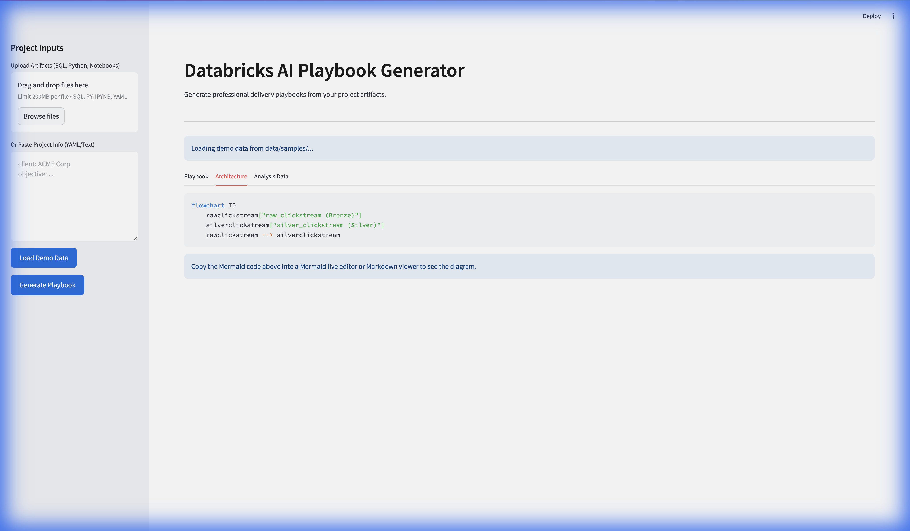

# Databricks AI Playbook Generator

An AI tool that takes Databricks project artifacts (SQL notebooks, Python notebooks, config files, project description) and automatically generates a consulting “Project Delivery Playbook”.

## Setup

1. Create a virtual environment:
   ```bash
   python3 -m venv venv
   source venv/bin/activate
   ```

2. Install dependencies:
   ```bash
   pip install -r requirements.txt
   ```

3. Create a `.env` file with your OpenAI API key:
   ```
   OPENAI_API_KEY=your_key_here
   ```

## Usage

Run the Streamlit app:
```bash
streamlit run app/ui/streamlit_app.py
```

## Screenshots

### Home Page


### Generated Playbook


### Architecture Diagram


